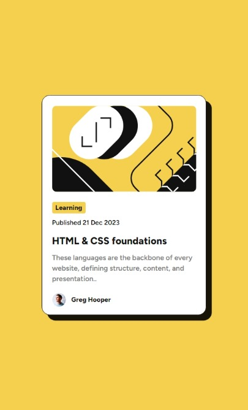

# Frontend Mentor - Blog preview card solution

This is a solution to the [Blog preview card challenge on Frontend Mentor](https://www.frontendmentor.io/challenges/blog-preview-card-ckPaj01IcS). Frontend Mentor challenges help you improve your coding skills by building realistic projects.

## Table of contents

- [Overview](#overview)
  - [The challenge](#the-challenge)
  - [Screenshot](#screenshot)
  - [Links](#links)
- [My process](#my-process)
  - [Built with](#built-with)
  - [Continued development](#continued-development)
  - [Useful resources](#useful-resources)
- [Author](#author)

## Overview

This project is a simple blog preview card created with HTML and CSS. It features a responsive design with a hover effect, providing an interactive experience for users.

### The challenge

The challenge was to build a blog preview card that includes a title, image, excerpt, and a "author" with profile image. The card should be responsive and have a hover effect for enhanced user interaction.

### Screenshot

### Links

- [Live Demo](#) <!-- Add the link to your live demo once it's deployed -->
- [GitHub Repository](https://github.com/mousa-creations/blog-preview-card)

## My process

### Built with

- Semantic HTML5 markup
- CSS custom properties
- Flexbox
- Google Fonts ([Figtree](https://fonts.google.com/specimen/Figtree))

### Continued development

This project can be further developed by adding more features such as:

- Integration with a back-end to fetch real blog data.
- Adding animations for a smoother transition on hover.
- Implementing a dynamic way to load different blog content.

### Useful resources

- [W3schools](https://www.w3schools.com)

## Author

- Website - [Muhamad Mousa](https://www.arabtoutrial.com/)
- Frontend Mentor - [@mousa-creations](https://www.frontendmentor.io/profile/mousa-creations)
- Twitter - [@BalShrwhat](https://www.twitter.com/BalShrwhat)
